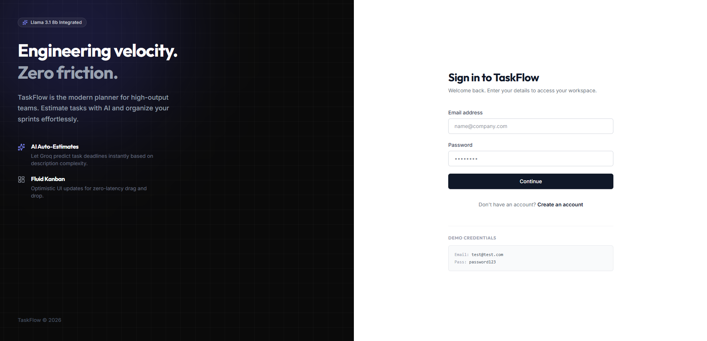
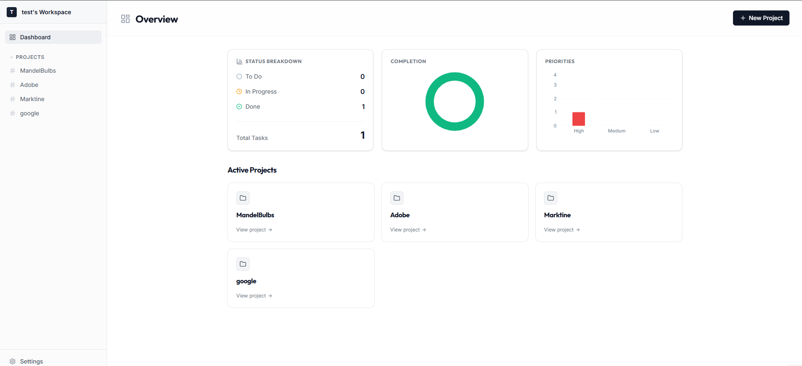
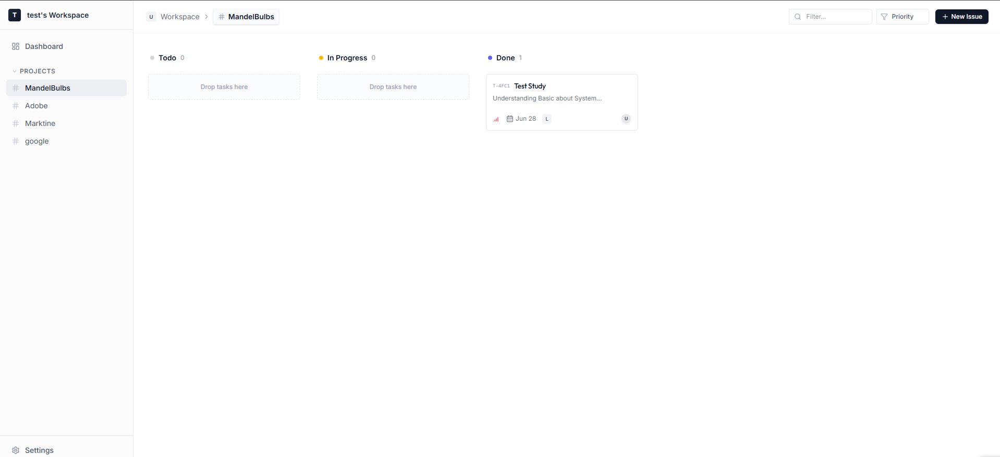
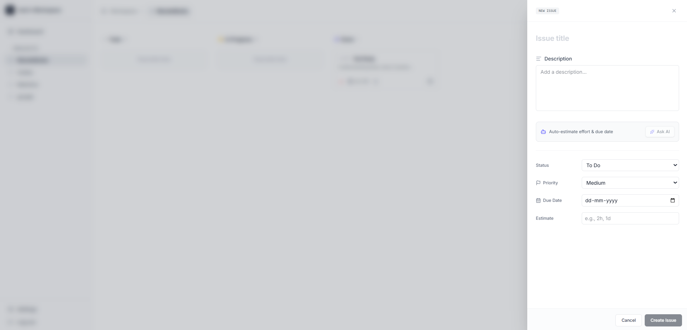

# TaskFlow Frontend 🎨

TaskFlow is a beautiful, highly interactive Kanban board application with AI-powered task estimations. This frontend is built with React and Vite, featuring a vibrant Glassmorphism design system.

##  Screenshots

*(Replace these placeholders with actual screenshots before submitting)*


- **Login Page:**
  
  

- **Dashboard:**
  
  

- **Board View (Drag & Drop):**
  
  

- **AI Task Estimator Drawer:**
  
  


##  Tech Stack & Libraries
- **Build Tool:** Vite
- **Framework:** React.js
- **Routing:** React Router v6
- **Styling:** TailwindCSS (v4)
- **State Management / Data Fetching:** React Query (`@tanstack/react-query`)
- **Drag & Drop:** `@dnd-kit/core`
- **Charts:** Recharts
- **Icons:** Lucide React
- **HTTP Client:** Axios

##  Setup & Local Installation

1. **Navigate to the frontend directory:**
   ```bash
   cd frontend
   ```

2. **Install dependencies:**
   ```bash
   npm install
   ```

3. **Configure Environment Variables:**
   Create a `.env` file based on the provided `.env.example`:
   ```bash
   cp .env.example .env
   ```

4. **Start the development server:**
   ```bash
   npm run dev
   ```
   *(App will run on `http://localhost:5173`)*

## 🔐 Environment Variables (`.env.example`)

```env
# Backend API URL (Use localhost for dev, Render URL for production)
VITE_API_URL=http://localhost:5000/api
```

## 🧠 AI Feature Integration
This frontend integrates an AI Auto-Estimator inside the Task Modal. 
When a user enters a Task Title and Description, they can click "Generate Estimates". The frontend triggers an API call to the backend, which forwards the request to **Groq (Llama 3.1 8b)**. The resulting JSON payload automatically populates the "Due Date" and "Estimated Effort" input fields, eliminating manual data entry overhead.

## 🔗 Links & Credentials
- **Frontend Live Demo:** [https://taskflowmanger.netlify.app](https://taskflowmanger.netlify.app)
- **Backend Live API:** `[Insert Render Backend URL Here]`
- **Test Credentials:** 
  - Email: `test@test.com`
  - Password: `password123`

## ⚠️ Known Issues & Future Improvements
- **Issue:** Drag and drop is optimized for mouse input. Touch sensor configuration for strictly mobile environments can sometimes feel overly sensitive.
- **Improvement:** Add dark mode toggle (We previously experimented with Dark Aurora and Neo-Brutalism themes, making the UI themeable would be an excellent extension).
- **Improvement:** Implement global search and filtering for tasks across *all* boards from the main dashboard.
